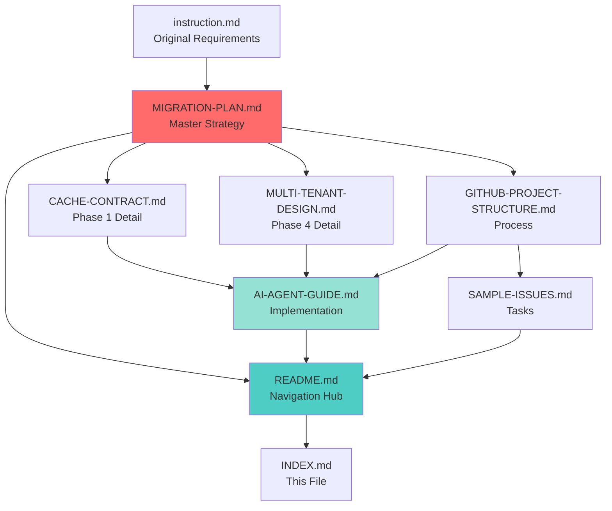

# 📚 CloudFolio Migration Documentation Index

**Project**: CloudFolio Canary → Early Adoption Migration  
**Generated**: October 7, 2025  
**Status**: ✅ Documentation Complete, Ready for Implementation

---

## 🎯 Quick Navigation

### 👤 I am a...

**Project Manager / Stakeholder**  
→ Start here: [📊 MIGRATION-PLAN.md](./MIGRATION-PLAN.md) (Overall strategy & timeline)  
→ Then read: [📋 GITHUB-PROJECT-STRUCTURE.md](./GITHUB-PROJECT-STRUCTURE.md) (Board setup)

**Backend Developer (Human)**  
→ Start here: [📖 README.md](./README.md) (Project overview)  
→ Then read: [🛠️ AI-AGENT-GUIDE.md](./AI-AGENT-GUIDE.md) (Coding patterns)  
→ Reference: [💾 CACHE-CONTRACT.md](./CACHE-CONTRACT.md) (API spec)

**DevOps Engineer**  
→ Start here: [📊 MIGRATION-PLAN.md](./MIGRATION-PLAN.md) (Infrastructure changes)  
→ Then read: [🔒 MULTI-TENANT-DESIGN.md](./MULTI-TENANT-DESIGN.md) (Isolation patterns)

**AI Coding Agent (Copilot, Cursor, etc.)**  
→ Start here: [🤖 AI-AGENT-GUIDE.md](./AI-AGENT-GUIDE.md) (Implementation reference)  
→ Then load: [💾 CACHE-CONTRACT.md](./CACHE-CONTRACT.md) + [🔒 MULTI-TENANT-DESIGN.md](./MULTI-TENANT-DESIGN.md)

**New Team Member**  
→ Start here: [📖 README.md](./README.md) (Landing page)  
→ Then read: [📊 MIGRATION-PLAN.md](./MIGRATION-PLAN.md) (Context & goals)

---

## 📂 All Documents (Alphabetical)

### 🤖 [AI-AGENT-GUIDE.md](./AI-AGENT-GUIDE.md)
**Purpose**: Development reference for AI coding agents  
**Size**: ~9,000 words | **Target**: AI agents, developers  
**Contents**:
- File navigation map & context loading priority
- Coding patterns (cache ops, error handling, logging, feature flags)
- Common task workflows (add cache type, add monitoring, refactor username)
- Testing checklist & debugging guide
- Performance tips & useful commands

**Use When**: Implementing any code changes

---

### 💾 [CACHE-CONTRACT.md](./CACHE-CONTRACT.md)
**Purpose**: Definitive cache layer API specification  
**Size**: ~8,000 words | **Target**: Backend developers, AI agents  
**Contents**:
- Cache key types (bundle, repo, model) with JSON schemas
- TTL policies & fingerprint logic
- Multi-tenant isolation patterns
- Monitoring KQL queries
- Error handling & local development

**Use When**: Writing code that touches cache_manager.py

---

### 📄 [FILES-SUMMARY.md](./FILES-SUMMARY.md)
**Purpose**: Meta-documentation overview  
**Size**: ~3,000 words | **Target**: All stakeholders  
**Contents**:
- Summary of all generated files
- Documentation statistics & completeness
- File relationships & navigation flow
- Success indicators & quality metrics

**Use When**: Understanding doc structure or assessing completeness

---

### 📋 [GITHUB-PROJECT-STRUCTURE.md](./GITHUB-PROJECT-STRUCTURE.md)
**Purpose**: Kanban board configuration & workflow  
**Size**: ~6,000 words | **Target**: Project managers, developers  
**Contents**:
- Column definitions (Backlog → Done)
- Labels schema (priority, phase, type, component)
- 6 milestone definitions (Week 1-6)
- Issue templates (feature, bug, docs)
- Automation rules & weekly workflow

**Use When**: Setting up GitHub Projects board or triaging issues

---

### 🎯 [INDEX.md](./INDEX.md)
**Purpose**: This file - quick navigation hub  
**Size**: ~2,000 words | **Target**: Everyone  
**Contents**:
- Role-based navigation paths
- Document summaries with use cases
- Reading order recommendations
- Visual dependency diagram

**Use When**: First time visiting this directory

---

### 📝 [instruction.md](./instruction.md)
**Purpose**: Original migration requirements (provided by user)  
**Size**: ~1,000 words | **Target**: Historical reference  
**Contents**:
- Current monolithic architecture problems
- Migration mission & guiding principles
- Bottleneck identification

**Use When**: Understanding original requirements or verifying scope

---

### 📊 [MIGRATION-PLAN.md](./MIGRATION-PLAN.md)
**Purpose**: Master migration roadmap & strategy  
**Size**: ~15,000 words | **Target**: All stakeholders  
**Contents**:
- Current architecture bottleneck analysis
- 6-phase implementation plan (Weeks 1-6)
- Risk management & rollback procedures
- Success metrics & timeline
- Feature flag strategy

**Use When**: Planning sprints, making architectural decisions, or explaining project scope

**⭐ MOST IMPORTANT DOCUMENT** - Read first for big picture

---

### 🔒 [MULTI-TENANT-DESIGN.md](./MULTI-TENANT-DESIGN.md)
**Purpose**: Tenant isolation patterns & multi-user preparation  
**Size**: ~7,000 words | **Target**: Backend developers, architects  
**Contents**:
- Username-based tenant identification
- Cache, logging, quota isolation patterns
- Security considerations (data leakage prevention)
- Migration path from single-user to multi-tenant
- Admin operations & monitoring

**Use When**: Implementing Phase 4 (Multi-Tenant Prep) or refactoring for multi-user

---

### 📖 [README.md](./README.md)
**Purpose**: Central documentation hub & landing page  
**Size**: ~4,000 words | **Target**: All project members  
**Contents**:
- Documentation index with summaries
- Quick start guides (humans vs. AI agents)
- Phase overview table & progress tracking
- Development setup instructions
- Troubleshooting FAQ

**Use When**: First-time orientation or finding other docs

**⭐ START HERE** if new to project

---

### ✅ [SAMPLE-ISSUES.md](./SAMPLE-ISSUES.md)
**Purpose**: Pre-written GitHub issues for Phases 1-4  
**Size**: ~6,000 words | **Target**: Project managers, developers  
**Contents**:
- 10 detailed issues with acceptance criteria
- Phase 1: Cache standardization (5 issues)
- Phase 2: Model training decoupling (2 issues)
- Phase 3: GitHub sync optimization (1 issue)
- Phase 4: Multi-tenant preparation (2 issues)

**Use When**: Populating GitHub Projects backlog

---

## 📖 Recommended Reading Order

### For First-Time Readers
```
1. README.md (10 min) - Get oriented
2. MIGRATION-PLAN.md (30 min) - Understand strategy
3. [Your role-specific doc] (20 min) - Deep dive
4. SAMPLE-ISSUES.md (10 min) - See tasks
```

### For Implementation
```
1. AI-AGENT-GUIDE.md (15 min) - Load patterns
2. [Phase-specific doc] (15 min) - Understand context
3. SAMPLE-ISSUES.md (5 min) - Pick a task
4. [Start coding, reference docs as needed]
```

### For Troubleshooting
```
1. README.md#Troubleshooting (5 min) - Check FAQ
2. AI-AGENT-GUIDE.md#Debugging (10 min) - Debug steps
3. [Component-specific doc] (5 min) - Context
```

---

## 🔗 Document Dependencies



**Legend**:
- 🔴 Red: Master strategy document
- 🔵 Blue: Navigation/index
- 🟢 Green: Implementation reference

---

## 📏 Documentation Coverage

### By Phase
| Phase | Planning Docs | Sample Issues | Status |
|-------|--------------|---------------|--------|
| **Phase 1: Cache** | ✅ CACHE-CONTRACT.md | ✅ 5 issues | Ready |
| **Phase 2: Training** | ✅ MIGRATION-PLAN.md § Phase 2 | ✅ 2 issues | Ready |
| **Phase 3: GitHub Sync** | ✅ MIGRATION-PLAN.md § Phase 3 | ✅ 1 issue | Ready |
| **Phase 4: Multi-Tenant** | ✅ MULTI-TENANT-DESIGN.md | ✅ 2 issues | Ready |
| **Phase 5: Observability** | ✅ MIGRATION-PLAN.md § Phase 5 | ⏳ TBD | Outlined |
| **Phase 6: Production** | ✅ MIGRATION-PLAN.md § Phase 6 | ⏳ TBD | Outlined |

### By Artifact Type
| Type | Count | Examples |
|------|-------|----------|
| **Architecture Diagrams** | 4 | Mermaid in MIGRATION-PLAN.md |
| **Code Examples** | 50+ | Python, Bash, KQL |
| **API Schemas** | 10+ | JSON examples |
| **Monitoring Queries** | 15+ | KQL in multiple docs |
| **Test Patterns** | 20+ | pytest examples |
| **Issue Templates** | 10 | SAMPLE-ISSUES.md |

---

## 🎓 Learning Paths

### Path 1: Backend Developer Onboarding (2-3 hours)
```
Session 1: Overview (1 hour)
- README.md (15 min)
- MIGRATION-PLAN.md (30 min)
- GITHUB-PROJECT-STRUCTURE.md (15 min)

Session 2: Technical Deep Dive (1 hour)
- CACHE-CONTRACT.md (30 min)
- AI-AGENT-GUIDE.md (30 min)

Session 3: Hands-On (30 min)
- Pick issue from SAMPLE-ISSUES.md
- Set up local environment
- Make first commit

Session 4: Review & Questions (30 min)
- PR review of first commit
- Address questions
```

### Path 2: AI Agent Context Loading (30 min)
```
Priority 1: Core Patterns (15 min)
- AI-AGENT-GUIDE.md (all sections)

Priority 2: API Specs (10 min)
- CACHE-CONTRACT.md (schema sections)
- MULTI-TENANT-DESIGN.md (isolation patterns)

Priority 3: Task Context (5 min)
- Specific issue from SAMPLE-ISSUES.md
- Related code files
```

### Path 3: Project Manager Orientation (1 hour)
```
Strategic Understanding (30 min)
- MIGRATION-PLAN.md (executive summary + phases)
- README.md (success metrics)

Operational Setup (30 min)
- GITHUB-PROJECT-STRUCTURE.md (board setup)
- SAMPLE-ISSUES.md (import issues)
- Create first milestone
```

---

## 🔍 Search Tips

### Finding Information Quickly

**"How do I...?"** questions:
- Check **AI-AGENT-GUIDE.md** § Common Task Workflows

**"What is...?"** questions:
- Check **CACHE-CONTRACT.md** for cache concepts
- Check **MULTI-TENANT-DESIGN.md** for tenant concepts
- Check **MIGRATION-PLAN.md** for architecture

**"When should...?"** questions:
- Check **MIGRATION-PLAN.md** for timeline
- Check **GITHUB-PROJECT-STRUCTURE.md** for workflow

**"Why are we...?"** questions:
- Check **instruction.md** for original requirements
- Check **MIGRATION-PLAN.md** for rationale

### Using Search Effectively
```bash
# Find all references to a topic across docs
cd .github/project/
grep -i "cache manager" *.md

# Find KQL queries
grep -A 10 "```kusto" *.md

# Find code examples
grep -A 10 "```python" *.md
```

---

## ✅ Quality Checklist

### Before Starting Phase 1
- [ ] All team members have read README.md
- [ ] GitHub Projects board created from GITHUB-PROJECT-STRUCTURE.md
- [ ] Issues imported from SAMPLE-ISSUES.md
- [ ] Staging environment set up
- [ ] Baseline metrics captured (from MIGRATION-PLAN.md)

### During Development
- [ ] AI-AGENT-GUIDE.md patterns followed
- [ ] Feature flags implemented per MIGRATION-PLAN.md
- [ ] Tenant context in logs per MULTI-TENANT-DESIGN.md
- [ ] Cache operations use CACHE-CONTRACT.md API

### After Each Phase
- [ ] Success criteria met (from MIGRATION-PLAN.md)
- [ ] Documentation updated with lessons learned
- [ ] Next phase issues created
- [ ] Retrospective completed

---

## 📞 Getting Help

### Document Issues
| Problem | Solution |
|---------|----------|
| **Doc not clear** | Open GitHub Discussion with `docs: question` |
| **Missing info** | Create issue with `docs: improvement` |
| **Factual error** | Submit PR with correction |
| **Can't find topic** | Search tips above or ask in team chat |

### Implementation Issues
| Problem | Solution |
|---------|----------|
| **Don't understand task** | Check SAMPLE-ISSUES.md for acceptance criteria |
| **Pattern not clear** | Review AI-AGENT-GUIDE.md examples |
| **Need code review** | Tag reviewer in PR, reference relevant doc |
| **Blocked on dependency** | Add `status: blocked` label, mention in standup |

---

## 🎯 Success Indicators

**Documentation is working if**:
- ✅ Developers start tasks without clarification questions
- ✅ AI agents implement features following patterns
- ✅ PRs reference relevant docs in descriptions
- ✅ Onboarding takes <3 hours
- ✅ Rollback procedures work as documented

**Track these metrics**:
- Time from issue → PR
- Number of "how do I...?" questions
- Documentation update frequency
- Developer satisfaction (survey post-project)

---

## 🚀 Next Steps

### Immediate Actions
1. **Read this INDEX.md** (you are here)
2. **Navigate to README.md** for full orientation
3. **Review MIGRATION-PLAN.md** for strategy
4. **Set up GitHub Projects** using GITHUB-PROJECT-STRUCTURE.md

### This Week
1. Import issues from SAMPLE-ISSUES.md
2. Assign Phase 1 tasks
3. Set up staging environment
4. Begin development

---

## 📊 Statistics

**Documents**: 9 total (8 new + 1 original)  
**Total Words**: ~55,000  
**Total Pages**: ~110 (at 500 words/page)  
**Code Examples**: 50+  
**Diagrams**: 4 Mermaid charts  
**Sample Issues**: 10 detailed issues  
**Estimated Read Time**: 3-4 hours (full corpus)  

---

**Document Type**: Index / Navigation Hub  
**Last Updated**: October 7, 2025  
**Status**: ✅ Complete & Ready  
**Maintainer**: Migration Team
