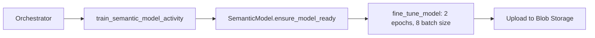
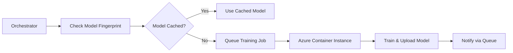

# CloudFolio Migration Plan: Canary to Early Adoption

**Status**: Draft  
**Version**: 1.0  
**Date**: October 7, 2025  
**Project Phase**: Canary → Early Adoption (Multi-tenant Ready)

---

## Executive Summary

CloudFolio currently operates as a monolithic Azure Functions application bundling stateful orchestration, high I/O GitHub synchronization, and compute-intensive ML model training. This migration plan outlines the strategy to decompose bottlenecks into independently scalable microservices while maintaining zero downtime and preparing for multi-tenant operations.

### Key Objectives
- **Decouple bottlenecks**: Separate compute-heavy (model training), I/O-bound (GitHub sync), and stateful services (cache)
- **Multi-tenant readiness**: Design with username-based routing and per-user quotas from day one
- **Cost optimization**: Start minimal; scale only proven bottlenecks
- **Zero-downtime migration**: Keep Function App running until each microservice is production-ready

---

## Current Architecture Analysis

### Monolithic Components (in `api/function_app.py`)

1. **Durable Orchestration** (Stateful)
   - `repo_context_orchestrator`: Coordinates parallel repo fetching
   - `get_stale_repos_activity`: Fingerprint comparison
   - `merge_repo_results_activity`: Bundle aggregation
   - **Issues**: Tied to compute-heavy model training; cannot scale independently

2. **GitHub Synchronization** (I/O Bound)
   - `fetch_repo_context_bundle_activity`: Fetches `.repo-context.json`, README, SKILLS-INDEX, ARCHITECTURE
   - `GitHubRepoManager`: REST API calls to GitHub
   - **Issues**: Rate-limited by GitHub API; blocks on network I/O

3. **Model Training** (Compute Heavy)
   - `train_semantic_model_activity`: Fine-tunes sentence transformers
   - `SemanticModel.fine_tune_model()`: PyTorch training with 2+ epochs
   - **Issues**: CPU/GPU intensive; runs infrequently but requires heavy resources

4. **Shared Cache** (State Management)
   - `cache_manager.py`: Azure Blob Storage for bundles, fingerprints, models
   - **Issues**: All services depend on this; no isolation or quota enforcement

### Bottleneck Identification

| Component | Type | Frequency | Resource | Scaling Need |
|-----------|------|-----------|----------|--------------|
| GitHub Sync | I/O | Per repo change | Network | Horizontal (parallel workers) |
| Model Training | Compute | Per fingerprint change (~weekly) | CPU/GPU | Vertical (dedicated instance) |
| Orchestration | Stateful | Per user request | Memory | Moderate (Durable Functions) |
| Cache | State | Every request | Storage | Minimal (Blob autoscales) |

---

## Migration Strategy

### Guiding Principles (from instruction.md)
1. **Start with data, not services**: Cache layer is the contract—nail it first
2. **One bottleneck per week**: Only extract services solving measured problems
3. **Feature flags over big-bang**: Deploy behind env vars; rollback via config
4. **Document as you build**: Every service gets README with local dev setup, API contract, rollback
5. **Multi-tenant defaults**: All services accept `username` parameter; log with tenant context

---

## Phase 1: Cache Layer Standardization (Week 1)

**Goal**: Establish cache as the single source of truth with multi-tenant isolation.

### Tasks
- [ ] **Audit Cache Keys**: Document all existing cache keys in `cache_manager.py`
  - Bundle: `repos_bundle_context_{username}`
  - Per-repo: `repo_context_{username}_{repo}`
  - Model: `fine_tuned_model_metadata` or `model_{fingerprint}`
- [ ] **Add Tenant Metadata**: Store `username` in blob metadata for all cache entries
- [ ] **Implement Quota Tracking**: Add per-user storage quota checks (prepare for multi-tenant limits)
- [ ] **Create Cache Service README**: Document cache schema, TTL policies, fingerprint logic
- [ ] **Add Monitoring**: Application Insights queries for cache hit/miss rates per user

### Deliverables
- `docs/CACHE-CONTRACT.md`: Cache key schema, TTL policies, tenant isolation patterns
- `api/config/cache_manager.py`: Updated with quota tracking methods
- Azure Dashboard: Cache metrics by username

### Success Criteria
- All cache operations log tenant context
- Cache hit rate tracked per username in Application Insights
- Documentation allows new service to consume cache without Function App code

---

## Phase 2: Model Training Decoupling (Week 2-3)

**Goal**: Extract model training into isolated service that can provision/deprovision heavy compute.

### Current Flow


### Target Architecture


### Implementation Steps

#### Step 1: Create Training Queue (Week 2)
- [ ] **Add Azure Storage Queue**: `model-training-queue`
- [ ] **Update Orchestrator**: Replace inline training with queue message
  ```python
  # In repo_context_orchestrator
  if not model_cached:
      queue_message = {
          'username': username,
          'fingerprint': fingerprint,
          'repos_bundle': merged_results
      }
      queue_client.send_message(json.dumps(queue_message))
  ```
- [ ] **Add Feature Flag**: `ENABLE_ASYNC_MODEL_TRAINING=false` (default: keep inline for now)

#### Step 2: Create Training Service (Week 3)
- [ ] **New Directory**: `api/services/model-training/`
  - `train.py`: Standalone script consuming queue messages
  - `Dockerfile`: Python 3.11 + torch==2.2.2+cpu + sentence-transformers
  - `requirements.txt`: Minimal deps (no Azure Functions runtime)
- [ ] **Local Testing**: `docker run --env-file .env model-training:local`
- [ ] **Deploy to ACI**: Use Azure Container Instances with CPU-optimized SKU
  - Provision only when queue has messages
  - Deprovision after training completes
- [ ] **Update Bicep**: Add ACI deployment parameters (commented out by default)

#### Step 3: Cutover (End of Week 3)
- [ ] **Enable Feature Flag**: `ENABLE_ASYNC_MODEL_TRAINING=true`
- [ ] **Monitor Logs**: Verify training jobs complete and upload models
- [ ] **Rollback Plan**: Set flag to `false` if failures > 5%

### Deliverables
- `api/services/model-training/README.md`: Local dev, Docker build, deployment
- `infra/modules/model-training-aci.bicep`: ACI deployment template
- Runbook: How to trigger manual training, check logs, rollback

### Success Criteria
- Training jobs complete without blocking orchestrator
- ACI instances auto-deprovision after 10 min idle
- Cost per training run tracked in Azure Cost Management

---

## Phase 3: GitHub Sync Optimization (Week 4)

**Goal**: Parallelize GitHub API calls and decouple from orchestration state.

### Current Bottleneck
- `fetch_repo_context_bundle_activity` runs serially per repo in orchestration
- Each activity makes 4+ GitHub API calls (metadata, README, SKILLS-INDEX, ARCHITECTURE, tree)
- Rate limited to 5000 req/hour for authenticated users

### Optimization Strategy
- **No new service**: Use Durable Functions fan-out (already implemented)
- **Batch API calls**: Use GitHub GraphQL to fetch README + files in 1 request
- **Cache aggressively**: Extend TTL for rarely-changing repos (e.g., archived repos)

### Tasks
- [ ] **Profile API Calls**: Log time per GitHub request in `github_api.py`
- [ ] **Implement GraphQL Batch**: Replace REST calls in `GitHubRepoManager.get_file_content()`
  ```python
  # Single GraphQL query for README + SKILLS-INDEX + ARCHITECTURE
  query = """
  query($owner: String!, $repo: String!) {
      repository(owner: $owner, name: $repo) {
          readme: object(expression: "HEAD:README.md") { ... }
          skills: object(expression: "HEAD:SKILLS-INDEX.md") { ... }
          arch: object(expression: "HEAD:ARCHITECTURE.md") { ... }
      }
  }
  """
  ```
- [ ] **Add Rate Limit Backoff**: Exponential backoff if GitHub returns 429
- [ ] **Monitor Quota**: Track remaining API quota in Application Insights

### Deliverables
- `api/config/github_api.py`: GraphQL batch fetch methods
- Performance comparison: Time to fetch 10 repos (before/after)

### Success Criteria
- GitHub API calls reduced by 50% for repos with multiple files
- Zero 429 rate limit errors in logs
- Orchestration completes 20% faster for large bundles (>10 repos)

---

## Phase 4: Multi-Tenant Routing Preparation (Week 5)

**Goal**: Prepare all services for multi-user isolation without breaking single-user operation.

### Current State
- Default username: `yungryce` hardcoded in multiple places
- No per-user quota enforcement
- Logs don't consistently include tenant context

### Tasks
- [ ] **Audit Hardcoded Usernames**: Search codebase for `yungryce`, replace with parameter
- [ ] **Add Tenant Context to Logs**: Structured logging with `username` field
  ```python
  logger.info("Processing repos", extra={"username": username, "repo_count": len(repos)})
  ```
- [ ] **Implement Usage Tracking**: Track API calls, cache size, model training per user
- [ ] **Add Quota Checks**: Soft limits (log warnings) for:
  - Cache storage per user: 100MB
  - Orchestration runs per day: 50
  - Model training per week: 2
- [ ] **Create Admin Dashboard**: Azure Workbook showing usage by username

### Deliverables
- `docs/MULTI-TENANT-DESIGN.md`: Tenant isolation patterns, quota policies
- KQL queries: Usage metrics per username
- Feature flag: `ENABLE_QUOTA_ENFORCEMENT=false` (prepare for future)

### Success Criteria
- All logs include `username` field
- Admin dashboard shows per-user cache sizes
- No hardcoded usernames in production code paths

---

## Phase 5: Observability & Rollback Procedures (Week 6)

**Goal**: Establish confidence in monitoring and rollback for each decoupled service.

### Monitoring Checklist
- [ ] **Application Insights Dashboards**
  - Orchestration duration by username
  - Cache hit rate by cache type (bundle, repo, model)
  - GitHub API quota remaining
  - Model training job success rate
- [ ] **Alerts**
  - Orchestration failures > 5% in 10 min
  - Cache hit rate < 70% (indicates invalidation issues)
  - GitHub rate limit < 500 remaining
  - Model training job timeout (>30 min)
- [ ] **Log Analytics Queries**
  - Per-user request volume trends
  - Slow operations (>5 sec) by component

### Rollback Procedures
Each feature flag must have documented rollback:

| Feature Flag | Rollback Action | Validation |
|-------------|----------------|------------|
| `ENABLE_ASYNC_MODEL_TRAINING` | Set to `false` → inline training resumes | Check orchestrator logs for training activity |
| `ENABLE_GRAPHQL_BATCH_FETCH` | Set to `false` → REST API fallback | Verify README fetch success rate |
| `ENABLE_QUOTA_ENFORCEMENT` | Set to `false` → warnings only | Confirm no 429 quota errors |

### Deliverables
- `docs/RUNBOOK.md`: Operations guide for common issues
- Postman collection: Health check endpoints for all services
- Rollback decision tree: When to rollback vs. investigate

---

## Risk Management

### High Risks
1. **Model Training Failures in ACI**
   - **Mitigation**: Keep inline training as fallback (feature flag)
   - **Detection**: Alert on training job timeout
   - **Rollback**: Set `ENABLE_ASYNC_MODEL_TRAINING=false`

2. **Cache Corruption from Concurrent Writes**
   - **Mitigation**: Use blob leases for write operations
   - **Detection**: Monitor cache validation failures
   - **Rollback**: Clear affected user's cache, re-orchestrate

3. **GitHub API Rate Limit Exhaustion**
   - **Mitigation**: Aggressive caching + backoff logic
   - **Detection**: Track remaining quota in Application Insights
   - **Rollback**: Increase cache TTL to 24 hours

### Medium Risks
1. **Increased Complexity for Debugging**
   - **Mitigation**: Correlation IDs across services
   - **Detection**: End-to-end trace in Application Insights
   - **Rollback**: N/A (operational issue)

2. **Cost Overruns from ACI Instances**
   - **Mitigation**: Set ACI auto-deprovision to 10 min idle
   - **Detection**: Azure Cost Management alerts
   - **Rollback**: Disable ACI deployment, use inline training

---

## Success Metrics

| Metric | Baseline (Current) | Target (Post-Migration) |
|--------|-------------------|-------------------------|
| Orchestration Duration (p95) | 45 sec | 30 sec |
| Model Training Time | 8 min (inline) | 12 min (async, but non-blocking) |
| Cache Hit Rate | 65% | 85% |
| GitHub API Calls per Bundle | 40 | 20 |
| Cost per 1000 Requests | $0.50 | $0.35 |
| Multi-tenant Isolation | None | Username-based quotas |

---

## Timeline Overview

| Week | Phase | Key Deliverable | Go/No-Go Decision |
|------|-------|----------------|-------------------|
| 1 | Cache Standardization | `CACHE-CONTRACT.md` | Cache metrics visible in dashboard |
| 2 | Training Queue Setup | Queue integration + feature flag | Queue messages processed successfully |
| 3 | Training Service Deployment | ACI training service live | 3 successful training runs without errors |
| 4 | GitHub Sync Optimization | GraphQL batch fetch | API call reduction measured |
| 5 | Multi-Tenant Prep | Usage tracking by username | Admin dashboard shows per-user data |
| 6 | Observability & Rollback | Runbook + alert rules | All alerts fire correctly in staging |

---

## Next Steps

1. **Review & Approve**: Circulate this plan to stakeholders (developers, DevOps, product)
2. **Create GitHub Project**: Break down tasks into issues with labels (Phase1, Phase2, etc.)
3. **Setup Staging Environment**: Clone production setup for safe testing
4. **Week 1 Kickoff**: Begin cache standardization tasks

---

## Appendix: Quick Reference

### Feature Flags
- `ENABLE_ASYNC_MODEL_TRAINING`: Enable async model training via ACI
- `ENABLE_GRAPHQL_BATCH_FETCH`: Use GraphQL for batched GitHub file fetching
- `ENABLE_QUOTA_ENFORCEMENT`: Enforce per-user quotas (soft limits initially)

### Key Files to Monitor
- `api/function_app.py`: Orchestration logic
- `api/config/cache_manager.py`: Cache operations
- `api/config/fine_tuning.py`: Model training logic
- `api/config/github_api.py`: GitHub API client

### Useful Commands
```bash
# Check cache size per user
az storage blob list --account-name <storage> --container-name github-cache --query "[].properties.contentLength" --output tsv | awk '{s+=$1} END {print s/1024/1024 " MB"}'

# Trigger manual training
curl -X POST https://<function-app>.azurewebsites.net/api/orchestrator_start \
  -H "Content-Type: application/json" \
  -d '{"username": "testuser", "force_refresh": true}'

# Check training queue depth
az storage queue show --name model-training-queue --account-name <storage> --query "metadata.approximateMessageCount"
```

---

**Document Owner**: Migration Team  
**Last Updated**: October 7, 2025  
**Next Review**: End of Week 1 (Cache Standardization)
