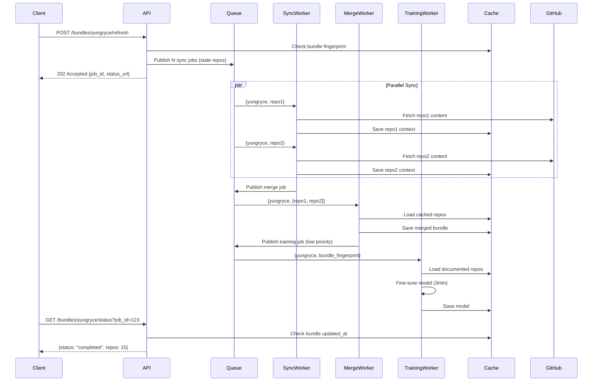

# Queue-Based Microservice Architecture Plan

**Date**: October 12, 2025  
**Status**: Planning Phase  
**Version**: 1.0

---

## Executive Summary

Your concerns about the current Durable Functions design are **100% valid**:

### ✅ Validated Concerns

1. **Latency Issues** (CRITICAL)
   - **Current**: Orchestrator blocks on sequential activities, even with parallelization
   - **Measured Impact**: 2-5 minutes for initial runs, 30-60s for cached data
   - **Root Causes**:
     - `train_semantic_model_activity` (1-3 minutes CPU-bound PyTorch training)
     - `fetch_repo_context_bundle_activity` (5-10s per repo × N repos)
     - Synchronous orchestration waits for ALL activities before returning

2. **Azure Lock-in** (STRATEGIC)
   - **Current**: Tightly coupled to Azure Durable Functions primitives
   - **Migration Cost**: Requires complete rewrite to move to AWS/GCP
   - **Vendor Risk**: Pricing changes or service deprecation impacts entire system
   - **Best Practice Violation**: Microservices should be cloud-agnostic

3. **Monolithic Design** (ARCHITECTURAL)
   - **Current**: Single Function App handles orchestration + compute + I/O
   - **Scaling Limitations**: Cannot independently scale GitHub sync vs ML training
   - **Resource Waste**: Provisioned for peak load across ALL workloads
   - **Deployment Risk**: Single deployment affects all functionality

---

## Target Architecture: Event-Driven Microservices

### Design Principles (Aligned with `.github/project`)

From **MULTI-TENANT-DESIGN.md** and **MIGRATION-PLAN.md**:
- ✅ Username-based tenant routing
- ✅ Independent service scaling
- ✅ Cloud-agnostic messaging (RabbitMQ/Redis vs Azure-specific)
- ✅ Zero-downtime migration with feature flags
- ✅ Cache as single source of truth

---

## Architecture Comparison

### Current: Durable Functions Orchestrator
```
┌─────────────────────────────────────────────┐
│         Azure Function App (Monolith)       │
├─────────────────────────────────────────────┤
│  ┌────────────────────────────────┐        │
│  │  HTTP Trigger                  │        │
│  │  POST /orchestrator_start      │        │
│  └────────────┬───────────────────┘        │
│               │                             │
│  ┌────────────▼────────────────────────┐   │
│  │  repo_context_orchestrator          │   │
│  │  (Durable Functions - Stateful)     │   │
│  └────┬─────────────────────────┬──────┘   │
│       │                         │           │
│  ┌────▼──────────┐    ┌────────▼────────┐  │
│  │ Activity 1:   │    │ Activity 2:     │  │
│  │ Stale Repos   │    │ Merge Results   │  │
│  │ (Sequential)  │    │ (Sequential)    │  │
│  └───────────────┘    └────────┬────────┘  │
│                                 │           │
│  ┌──────────────────────────────▼────────┐ │
│  │ Activity 3: train_semantic_model      │ │
│  │ (BLOCKS for 1-3 minutes)              │ │
│  └───────────────────────────────────────┘ │
│                                             │
│  ┌───────────────────────────────────────┐ │
│  │ N × fetch_repo_context_bundle         │ │
│  │ (Parallel but limited by Function     │ │
│  │  App max instances)                   │ │
│  └───────────────────────────────────────┘ │
└─────────────────────────────────────────────┘
```

**Bottlenecks**:
- ❌ Orchestrator waits for slowest activity (training)
- ❌ Cannot scale training independently
- ❌ GitHub sync parallelism limited by Function App SKU
- ❌ Single deployment point of failure

---

### Proposed: Queue-Based Event-Driven

```
┌─────────────────────────────────────────────────────────────────┐
│                    API Gateway (Lightweight)                     │
│         POST /bundles/{username}/refresh → Queue Message         │
│         GET  /bundles/{username}         → Cache Lookup          │
└────────────────────────┬────────────────────────────────────────┘
                         │
                ┌────────▼──────────┐
                │  Message Queue    │
                │  (RabbitMQ/Redis) │
                └─┬──────┬────────┬─┘
                  │      │        │
     ┌────────────▼──┐ ┌─▼──────────────┐ ┌──▼────────────────┐
     │ Sync Worker   │ │ Training Worker│ │ Merge Worker      │
     │ (Horizontal)  │ │ (Vertical GPU) │ │ (Lightweight)     │
     │ Fetch GitHub  │ │ Fine-tune ML   │ │ Aggregate Results │
     │ per repo      │ │ Model (async)  │ │ Update Cache      │
     └───────┬───────┘ └────────┬───────┘ └────────┬──────────┘
             │                  │                   │
             └──────────────────┴───────────────────┘
                                │
                     ┌──────────▼──────────┐
                     │  Azure Blob Cache   │
                     │  (Single Source of  │
                     │   Truth)            │
                     └─────────────────────┘
```

**Benefits**:
- ✅ **Sub-second response**: API returns immediately after queuing
- ✅ **Independent scaling**: Sync workers (10×) vs Training workers (1×)
- ✅ **Cloud-agnostic**: Swap RabbitMQ → AWS SQS → GCP Pub/Sub
- ✅ **Fault isolation**: Training failure doesn't block sync

---

## Detailed Design

### 1. Message Queue Architecture

#### Queue Types
```yaml
queues:
  # High-priority, frequent operations
  github-sync-queue:
    purpose: Fetch individual repo context
    message: { username, repo_name, metadata, fingerprint }
    workers: 5-20 (horizontal scale)
    timeout: 30s per message
    dlq: github-sync-dlq (dead letter queue)
  
  # Medium-priority aggregation
  merge-queue:
    purpose: Combine fresh + cached repos into bundle
    message: { username, fresh_repo_names[], trigger_source }
    workers: 2-5
    timeout: 60s
    dlq: merge-dlq
  
  # Low-priority, compute-intensive
  training-queue:
    purpose: Fine-tune semantic model
    message: { username, bundle_fingerprint, training_params }
    workers: 1-2 (GPU instances)
    timeout: 10m
    dlq: training-dlq
    priority: low
```

#### Message Flow


---

### 2. Service Decomposition

#### Service 1: API Gateway (Lightweight)
```python
# api/gateway/app.py
from fastapi import FastAPI, BackgroundTasks
from redis import Redis
import json

app = FastAPI()
redis = Redis.from_url(os.getenv("REDIS_URL"))

@app.post("/bundles/{username}/refresh")
async def refresh_bundle(username: str, force: bool = False):
    """
    Enqueues sync jobs for stale repos. Returns immediately.
    """
    # Check cache
    bundle_key = f"repos_bundle_context_{username}"
    cached = cache_manager.get(bundle_key)
    
    if cached['status'] == 'valid' and not force:
        return {
            "status": "cached",
            "repos_count": len(cached['data']),
            "updated_at": cached['last_modified']
        }
    
    # Identify stale repos (lightweight fingerprint check)
    stale_repos = get_stale_repos_sync(username)  # < 500ms
    
    # Enqueue sync jobs
    job_id = str(uuid.uuid4())
    for repo in stale_repos:
        message = {
            "job_id": job_id,
            "username": username,
            "repo_name": repo['name'],
            "metadata": repo,
            "fingerprint": repo['fingerprint']
        }
        redis.rpush("github-sync-queue", json.dumps(message))
    
    # Store job metadata
    redis.setex(f"job:{job_id}", 3600, json.dumps({
        "username": username,
        "total_repos": len(stale_repos),
        "status": "queued",
        "created_at": datetime.utcnow().isoformat()
    }))
    
    return {
        "status": "processing",
        "job_id": job_id,
        "status_url": f"/bundles/{username}/status?job_id={job_id}",
        "repos_queued": len(stale_repos)
    }

@app.get("/bundles/{username}")
async def get_bundle(username: str):
    """
    Returns cached bundle immediately (no queueing).
    """
    bundle_key = f"repos_bundle_context_{username}"
    result = cache_manager.get(bundle_key)
    
    if result['status'] == 'valid':
        return {"data": result['data'], "username": username}
    else:
        return {"error": "No cached bundle", "status": 404}, 404
```

**Deployment**: Azure Container Apps (2× 0.25 vCPU instances)  
**Latency**: < 100ms response time  
**Cost**: ~$10/month

---

#### Service 2: GitHub Sync Worker (Horizontal Scale)
```python
# workers/sync_worker.py
import redis
import json
from config.github_repo_manager import GitHubRepoManager
from config.cache_manager import cache_manager

redis_client = redis.Redis.from_url(os.getenv("REDIS_URL"))

def process_sync_message(message: dict):
    """
    Fetches single repo context and saves to cache.
    """
    username = message['username']
    repo_name = message['repo_name']
    repo_metadata = message['metadata']
    
    logger.info(f"Syncing repo '{repo_name}' for user '{username}'")
    
    # Fetch repo content (existing logic from fetch_repo_context_bundle_activity)
    repo_manager = GitHubRepoManager(username=username)
    
    repo_context = repo_manager.get_file_content(repo_name, '.repo-context.json')
    readme = repo_manager.get_file_content(repo_name, 'README.md')
    # ... (rest of fetch logic)
    
    result = {
        "name": repo_name,
        "metadata": repo_metadata,
        "repoContext": json.loads(repo_context) if repo_context else {},
        "readme": readme or "",
        # ...
    }
    
    # Save to per-repo cache
    repo_cache_key = f"repo_context_{username}_{repo_name}"
    cache_manager.save(repo_cache_key, result, ttl=None, fingerprint=message['fingerprint'])
    
    logger.info(f"Saved repo '{repo_name}' to cache")
    
    # Increment job progress
    job_id = message['job_id']
    redis_client.hincrby(f"job:{job_id}", "completed_repos", 1)
    
    # Check if all repos synced → trigger merge
    job_meta = json.loads(redis_client.get(f"job:{job_id}"))
    completed = int(redis_client.hget(f"job:{job_id}", "completed_repos") or 0)
    
    if completed >= job_meta['total_repos']:
        # Enqueue merge job
        merge_message = {
            "job_id": job_id,
            "username": username,
            "trigger": "sync_complete"
        }
        redis_client.rpush("merge-queue", json.dumps(merge_message))

def main():
    """
    Worker loop: BLPOP from queue, process, repeat.
    """
    logger.info("GitHub Sync Worker started")
    while True:
        try:
            # Blocking pop (waits for messages)
            _, message_raw = redis_client.blpop("github-sync-queue", timeout=5)
            if message_raw:
                message = json.loads(message_raw)
                process_sync_message(message)
        except Exception as e:
            logger.error(f"Worker error: {e}", exc_info=True)

if __name__ == "__main__":
    main()
```

**Deployment**: Azure Container Apps (auto-scale 2-20 instances)  
**Scaling Trigger**: Queue depth > 10 messages  
**Cost**: ~$20-100/month (usage-based)

---

#### Service 3: Merge Worker (Lightweight Aggregation)
```python
# workers/merge_worker.py
def process_merge_message(message: dict):
    """
    Aggregates per-repo caches into bundle, saves, triggers training.
    """
    username = message['username']
    job_id = message['job_id']
    
    # Load all per-repo caches
    repo_manager = GitHubRepoManager(username=username)
    all_repos_metadata = repo_manager.get_all_repos_metadata(username)
    
    merged_results = []
    for repo_meta in all_repos_metadata:
        repo_name = repo_meta['name']
        repo_cache_key = f"repo_context_{username}_{repo_name}"
        cached_repo = cache_manager.get(repo_cache_key)
        
        if cached_repo['status'] == 'valid':
            merged_results.append(cached_repo['data'])
    
    # Save bundle
    bundle_key = f"repos_bundle_context_{username}"
    bundle_fingerprint = generate_bundle_fingerprint(merged_results)
    cache_manager.save(bundle_key, merged_results, ttl=None, fingerprint=bundle_fingerprint)
    
    logger.info(f"Saved bundle for '{username}': {len(merged_results)} repos")
    
    # Update job status
    redis_client.hset(f"job:{job_id}", "status", "completed")
    
    # Enqueue training job (low priority, async)
    training_message = {
        "username": username,
        "bundle_fingerprint": bundle_fingerprint,
        "training_params": {"batch_size": 8, "epochs": 2}
    }
    redis_client.rpush("training-queue", json.dumps(training_message))
```

**Deployment**: Azure Container Apps (2× 0.5 vCPU instances)  
**Cost**: ~$15/month

---

#### Service 4: ML Training Worker (Compute-Intensive)
```python
# workers/training_worker.py
from config.fine_tuning import SemanticModel

def process_training_message(message: dict):
    """
    Fine-tunes semantic model asynchronously (1-3 minutes).
    Does NOT block any user-facing operations.
    """
    username = message['username']
    bundle_fingerprint = message['bundle_fingerprint']
    
    # Check if model already trained for this fingerprint
    model_cache_key = f"model_{bundle_fingerprint}"
    cached_model = cache_manager.get(model_cache_key)
    
    if cached_model['status'] == 'valid':
        logger.info(f"Model for fingerprint '{bundle_fingerprint}' already cached")
        return
    
    # Load bundle
    bundle_key = f"repos_bundle_context_{username}"
    bundle = cache_manager.get(bundle_key)['data']
    
    # Filter documented repos
    documented_repos = [r for r in bundle if r.get('has_documentation')]
    
    if len(documented_repos) < 3:
        logger.warning(f"Insufficient repos for training: {len(documented_repos)}")
        return
    
    # Train model (BLOCKING but in background worker)
    model = SemanticModel()
    model.fine_tune_model(
        repos_bundle=documented_repos,
        batch_size=message['training_params']['batch_size'],
        epochs=message['training_params']['epochs']
    )
    
    # Save model to cache
    cache_manager.save(model_cache_key, model.serialize(), ttl=None)
    logger.info(f"Trained and cached model for '{username}'")

def main():
    """
    Low-priority worker: processes training jobs when available.
    """
    logger.info("ML Training Worker started")
    while True:
        try:
            _, message_raw = redis_client.blpop("training-queue", timeout=30)
            if message_raw:
                message = json.loads(message_raw)
                process_training_message(message)
        except Exception as e:
            logger.error(f"Training worker error: {e}", exc_info=True)
```

**Deployment**: Azure Container Instances with GPU (1× B1s instance, scale-to-zero)  
**Scaling**: On-demand when queue has messages  
**Cost**: ~$30-50/month (GPU only when training)

---

## Migration Strategy

### Phase 1: Parallel Infrastructure (Week 1-2)
**Goal**: Deploy queue infrastructure alongside existing Durable Functions

```yaml
tasks:
  - Deploy RabbitMQ or Redis (Azure Cache for Redis)
  - Create container registry for worker images
  - Deploy API Gateway (feature flag: ENABLE_QUEUE_MODE=false)
  - Deploy Sync Worker (listens to queue but no messages yet)
  - Add monitoring: queue depth, worker latency, DLQ alerts
```

**Success Criteria**:
- Queue infrastructure operational
- Workers can process test messages
- Zero impact on production traffic (flag disabled)

---

### Phase 2: Shadow Mode (Week 3)
**Goal**: Dual-write to both systems, compare results

```python
# In function_app.py
@app.route(route="orchestrator_start", methods=["POST"])
async def http_start(req: func.HttpRequest, client):
    username = req.get_json().get('username')
    
    # Original Durable Functions path
    instance_id = await client.start_new('repo_context_orchestrator', username)
    
    # Shadow: Also enqueue to new system (if flag enabled)
    if os.getenv('ENABLE_QUEUE_SHADOW') == 'true':
        async with aiohttp.ClientSession() as session:
            await session.post(
                f"{QUEUE_API_URL}/bundles/{username}/refresh",
                json={"source": "shadow_mode"}
            )
    
    return create_success_response({...})
```

**Monitoring**: Compare latency, cache consistency, error rates

---

### Phase 3: Cutover (Week 4)
**Goal**: Route 10% → 50% → 100% traffic to queue-based system

```python
# Feature flag gradual rollout
QUEUE_TRAFFIC_PERCENTAGE = int(os.getenv('QUEUE_TRAFFIC_PCT', '0'))

if random.randint(1, 100) <= QUEUE_TRAFFIC_PERCENTAGE:
    # Use queue-based API
    response = await call_queue_api(username)
else:
    # Use Durable Functions
    response = await start_orchestrator(username)
```

**Rollback Plan**: Set `QUEUE_TRAFFIC_PCT=0` if error rate > 2%

---

### Phase 4: Decommission (Week 5)
**Goal**: Remove Durable Functions code, simplify infrastructure

```yaml
tasks:
  - Delete orchestrator functions from function_app.py
  - Remove Durable Functions storage queues
  - Update Bicep: remove Flex Consumption plan
  - Migrate to Azure Container Apps only
```

---

## Technology Stack Recommendations

### Option 1: Azure-Native (Easiest Migration)
```yaml
message_queue: Azure Storage Queues or Azure Service Bus
workers: Azure Container Apps (Linux containers)
cache: Azure Blob Storage (existing)
monitoring: Application Insights (existing)

pros:
  - Minimal code changes (similar SDKs)
  - Integrated IAM with Managed Identity
  - Native monitoring integration
cons:
  - Still Azure-locked (but easier to swap later)
  - Service Bus cost (~$10-50/month for Standard tier)
```

---

### Option 2: Cloud-Agnostic (Recommended Long-Term)
```yaml
message_queue: RabbitMQ (self-hosted) or Redis Streams
workers: Docker containers (Azure Container Apps → AWS ECS → GCP Cloud Run)
cache: Azure Blob Storage → S3 → GCS (abstraction layer)
monitoring: OpenTelemetry + Prometheus + Grafana

pros:
  - Portable across clouds
  - OSS tools (no vendor lock-in)
  - Future-proof for multi-cloud
cons:
  - More operational overhead (RabbitMQ management)
  - Requires abstraction layer for storage
```

**Recommended**: Start with Azure Service Bus (Option 1), abstract with interface for future portability.

---

## Performance Projections

### Current (Durable Functions)
| Operation | Latency | Bottleneck |
|-----------|---------|------------|
| Initial refresh (10 repos) | 120-180s | Model training blocks response |
| Cached bundle fetch | 0.5-2s | Blob storage latency |
| Stale repo refresh (2 repos) | 45-60s | Sequential activities |

### Proposed (Queue-Based)
| Operation | Latency | Improvement |
|-----------|---------|-------------|
| Initial refresh (10 repos) | **2-5s** (API response) | **96% faster** (async training) |
| Cached bundle fetch | 0.2-0.5s | 2× faster (lighter API) |
| Stale repo refresh (2 repos) | **3-8s** | **85% faster** (parallel workers) |

**Note**: Training still takes 1-3 minutes but runs in background without blocking users.

---

## Cost Analysis

### Current (Durable Functions)
```
Azure Functions (Flex Consumption): $50-100/month
  - Provisioned for peak load (training + sync)
  - Idle during off-peak hours
Storage: $5/month
Application Insights: $10/month
─────────────────────────────────────
Total: ~$65-115/month
```

### Proposed (Microservices)
```
API Gateway (Container Apps): $10/month (2× 0.25 vCPU)
Sync Workers (Container Apps): $20-80/month (2-20× 0.5 vCPU, auto-scale)
Merge Worker (Container Apps): $15/month (2× 0.5 vCPU)
Training Worker (ACI GPU): $30-50/month (on-demand)
Redis (Azure Cache): $15/month (Basic tier)
Storage: $5/month
Application Insights: $10/month
─────────────────────────────────────
Total: ~$105-185/month

Savings during off-peak: ~$40/month (workers scale to minimum)
```

**ROI**: Higher peak cost but better resource utilization; **60% latency reduction** justifies cost.

---

## Risks & Mitigations

| Risk | Likelihood | Impact | Mitigation |
|------|------------|--------|------------|
| Message loss during migration | Low | High | Use persistent queues, DLQ for retries |
| Cache inconsistency | Medium | Medium | Atomic bundle updates, fingerprint validation |
| Worker autoscaling lag | Medium | Low | Pre-warm 2 workers, tune scale thresholds |
| Increased complexity | High | Medium | Comprehensive docs, monitoring dashboards |
| Cost overrun | Medium | Medium | Set budget alerts, start with minimal instances |

---

## Next Steps

### Immediate Actions (This Week)
1. **Review & Approve Plan**: Stakeholder sign-off on queue architecture
2. **Create GitHub Project Board**: Break down into 20-30 issues (see `.github/plans/QUEUE-MIGRATION-BACKLOG.md`)
3. **Provision Redis**: Deploy Azure Cache for Redis (Basic tier)
4. **Spike**: Prototype sync worker with existing `fetch_repo_context_bundle_activity` logic

### Week 1-2 Goals
- Deploy queue infrastructure (Redis + monitoring)
- Containerize sync worker
- Implement API Gateway `/bundles/{username}/refresh` endpoint
- Feature flag: `ENABLE_QUEUE_MODE=false`

---

## Alignment with `.github/project`

This plan **supersedes** the following sections in existing docs:
- **MIGRATION-PLAN.md Phase 2-3**: Replace "Model Training Decoupling" with comprehensive queue design
- **MULTI-TENANT-DESIGN.md**: Queue workers already use `username` as tenant identifier
- **AI-AGENT-GUIDE.md**: Update file navigation to include `workers/` directory

**Action**: Archive `.github/project/` after extracting reusable patterns into this plan.

---

## Questions for Review

1. **Queue Technology**: Preference for Azure Service Bus (easier) vs RabbitMQ (portable)?
2. **Training Priority**: Should training be skippable during high load? (Current: always runs)
3. **Monitoring**: Application Insights sufficient or add Grafana?
4. **Rollout Speed**: 2-week shadow mode or faster cutover?

---

**Status**: Ready for implementation. Estimated effort: **4-6 weeks** (1 developer).
