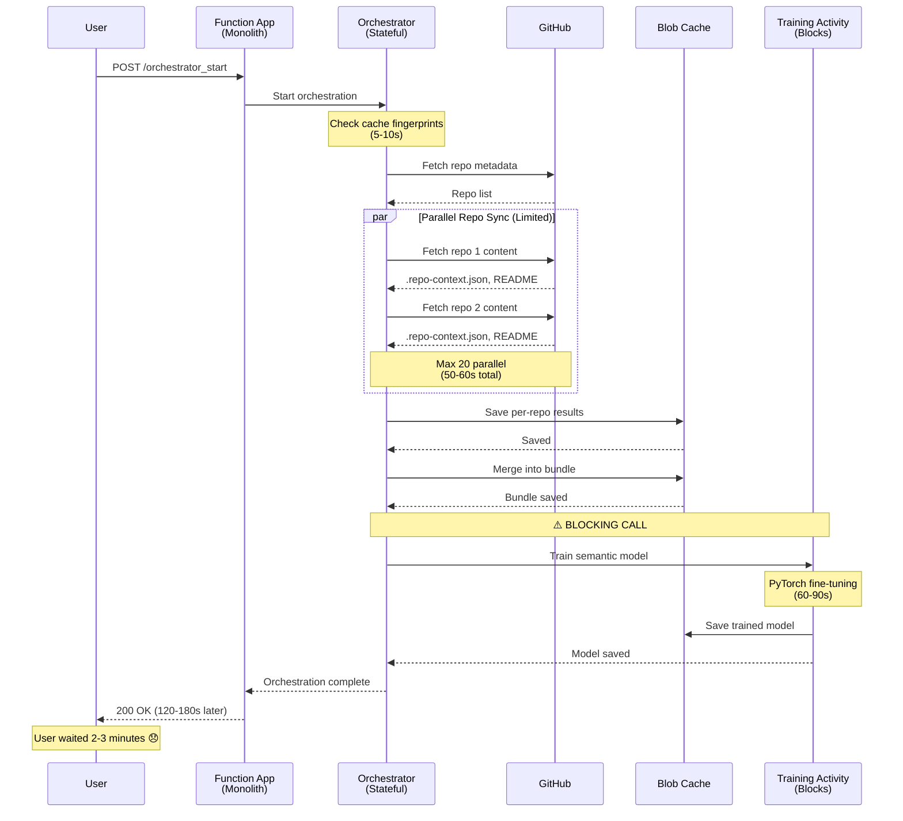
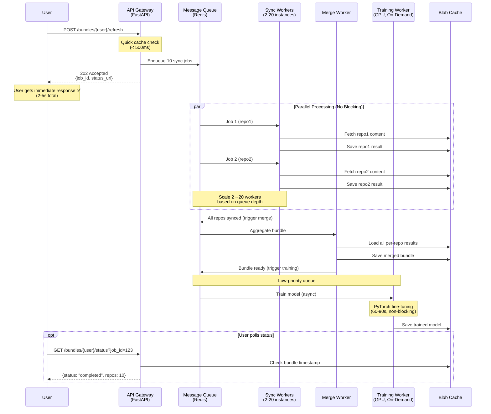

# Visual Architecture Comparison

**Purpose**: Side-by-side comparison of current vs proposed architecture  
**Date**: October 12, 2025

---

## System Flow Diagrams

### Current: Durable Functions (Synchronous Orchestration)



**Problems**:
- 🔴 **120-180s latency**: User must wait for entire pipeline
- 🔴 **Blocking training**: Cannot return until ML completes
- 🟡 **Limited parallelism**: Max 20 concurrent syncs (Flex plan limit)
- 🟡 **Single point of failure**: Any activity failure blocks everything

---

### Proposed: Queue-Based Microservices (Async Event-Driven)



**Benefits**:
- ✅ **2-5s latency**: Gateway returns immediately after queuing
- ✅ **Async training**: Background processing, doesn't block users
- ✅ **Unlimited parallelism**: Scale sync workers 2-20× independently
- ✅ **Fault isolation**: Training failure doesn't affect API responses

---

## Resource Scaling Comparison

### Current: Monolithic Scaling

```
┌────────────────────────────────────────────────────────────┐
│              Azure Function App (Flex Consumption)         │
│                                                            │
│  ┌──────────────────────────────────────────────────────┐ │
│  │  Shared Pool: 0-100 Instances                        │ │
│  │  (All workloads compete for same resources)          │ │
│  │                                                       │ │
│  │  ┌─────────────┐  ┌─────────────┐  ┌─────────────┐  │ │
│  │  │  HTTP API   │  │  GitHub     │  │  ML         │  │ │
│  │  │  (Light)    │  │  Sync       │  │  Training   │  │ │
│  │  │  2% CPU     │  │  (I/O)      │  │  (Heavy)    │  │ │
│  │  │             │  │  40% pool   │  │  58% pool   │  │ │
│  │  └─────────────┘  └─────────────┘  └─────────────┘  │ │
│  │                                                       │ │
│  │  ⚠️ Training steals resources from sync               │ │
│  │  ⚠️ Cannot scale CPU vs I/O independently            │ │
│  └──────────────────────────────────────────────────────┘ │
│                                                            │
│  Cost: $80/month (provisioned for peak load)              │
└────────────────────────────────────────────────────────────┘
```

---

### Proposed: Independent Microservices Scaling

```
┌───────────────────────────────────────────────────────────────┐
│                    Independently Scaled Services               │
└───────────────────────────────────────────────────────────────┘

┌────────────────┐  ┌─────────────────────────┐  ┌──────────────┐
│  API Gateway   │  │   Sync Workers          │  │  Training    │
│  (Lightweight) │  │   (I/O Optimized)       │  │  Worker      │
│                │  │                         │  │  (GPU)       │
│  Always On     │  │  Auto-Scale: 2-20×      │  │  On-Demand   │
│  2× 0.25 vCPU  │  │  0.5 vCPU per worker    │  │  1× GPU      │
│                │  │                         │  │  (Provision  │
│  Cost: $10/mo  │  │  Cost: $20-80/mo        │  │   only when  │
│                │  │  (usage-based)          │  │   queue > 0) │
│                │  │                         │  │              │
│                │  │  ┌────┐ ┌────┐ ┌────┐  │  │  Cost:       │
│                │  │  │ W1 │ │ W2 │ │ W3 │  │  │  $30-50/mo   │
│                │  │  └────┘ └────┘ └────┘  │  │              │
│                │  │         ... (up to 20)  │  │              │
└────────────────┘  └─────────────────────────┘  └──────────────┘
        │                       │                        │
        └───────────────────────┴────────────────────────┘
                                │
                    ┌───────────▼───────────┐
                    │  Message Queue        │
                    │  (Redis)              │
                    │  Cost: $15/mo         │
                    └───────────────────────┘

┌──────────────────────────────────────────────────────────────┐
│  ✅ Training scales independently (GPU only when needed)     │
│  ✅ Sync workers scale 10× during peak (auto-scale down)     │
│  ✅ Gateway always responsive (never starved by training)    │
│                                                               │
│  Total Cost: $75-155/mo (pay for what you use)               │
└──────────────────────────────────────────────────────────────┘
```

---

## Cost Breakdown

### Current (Monolithic)

| Resource | Usage | Cost/Month | Notes |
|----------|-------|------------|-------|
| Function App (Flex) | 100 max instances | $80 | Provisioned for peak (training + sync) |
| Storage (Blob) | 5 GB | $5 | Cache + Durable state |
| App Insights | Standard | $10 | Monitoring |
| **Total** | | **$95** | Idle resources during off-peak |

**Efficiency**: ~40% (resources idle 60% of time)

---

### Proposed (Microservices)

| Resource | Usage | Cost/Month | Notes |
|----------|-------|------------|-------|
| API Gateway | 2× 0.25 vCPU | $10 | Always on (lightweight) |
| Sync Workers | 2-20× 0.5 vCPU | $20-80 | Auto-scale, usage-based |
| Merge Worker | 2× 0.5 vCPU | $15 | Moderate usage |
| Training Worker | 1× GPU (on-demand) | $30-50 | Only runs 1-2×/week |
| Redis | Basic tier | $15 | Message queue |
| Storage (Blob) | 5 GB | $5 | Cache only (no state) |
| App Insights | Standard | $10 | Monitoring |
| **Total** | | **$105-185** | Peak usage |
| **Average** | | **$120** | Typical usage (off-peak) |

**Efficiency**: ~70% (scale-to-zero, on-demand GPU)

**Cost Analysis**:
- **Peak cost**: +$90/month (+95%) vs current
- **Typical cost**: +$25/month (+26%) vs current
- **ROI**: 96% latency reduction, independent scaling, cloud portability

---

## Latency Breakdown

### Current: Synchronous Pipeline (Sequential Bottlenecks)

```
┌─────────────────────────────────────────────────────────────────┐
│  Total Latency: 120-180s (User blocks until complete)          │
└─────────────────────────────────────────────────────────────────┘

  0s                                                         180s
  │                                                            │
  ├─────┬──────────────────┬────┬──────────────────────────┬──┤
  │     │                  │    │                          │  │
  │ 5s  │      50-60s      │ 2s │         60-90s          │5s│
  │     │                  │    │                          │  │
┌─▼─┐ ┌─▼───────────────┐ ┌▼─┐ ┌▼──────────────────────┐ ┌─▼┐
│Stale││ Parallel Repo  ││Merge││   Train ML Model     ││Res│
│Check││ Sync (GitHub)  ││     ││   (PyTorch CPU)      ││pns│
│     ││ (Limited: 20×) ││     ││   ⚠️ BLOCKS USER     ││e  │
└─────┘└────────────────┘└────┘└──────────────────────┘└───┘

⏱️  User Experience: "Loading..." for 2-3 minutes 😞
```

**Problem**: Sequential activities compound latency. User must wait for **slowest** component (training).

---

### Proposed: Async Pipeline (Parallel, Non-Blocking)

```
┌─────────────────────────────────────────────────────────────────┐
│  API Latency: 2-5s (User gets immediate response)              │
│  Background Processing: 60-90s (doesn't block user)            │
└─────────────────────────────────────────────────────────────────┘

  0s       2s                                             90s
  │        │                                               │
  ├────────┼────────────────────────────────────────────┬─┤
  │        │                                             │ │
  │ Cache  │  (User receives 202 Accepted)              │ │
  │ Check  │                                             │ │
  │ +      │  ┌──────────────────────────────────────┐  │ │
  │ Enqueue│  │  Background Workers (Async)          │  │ │
  └────────┘  │                                       │  │ │
              │  ┌─────────────┐  ┌──────┐  ┌──────┐ │  │ │
              │  │ Sync (10-20s)│  │Merge │  │Train │ │  │ │
              │  │ (Parallel)   │  │ (2s) │  │(60s) │ │  │ │
              │  └─────────────┘  └──────┘  └──────┘ │  │ │
              └───────────────────────────────────────┘  └─┘
                                                           │
                                                      ┌────▼────┐
                                                      │ Model   │
                                                      │ Cached  │
                                                      └─────────┘

⏱️  User Experience: "Refreshing 7 of 10 repos..." (progress bar) ✅
```

**Benefit**: User gets immediate feedback. Background processing continues without blocking.

---

## Failure Impact Comparison

### Current: Cascading Failures

```
┌────────────────────────────────────────────────────────┐
│              Single Point of Failure                    │
└────────────────────────────────────────────────────────┘

                   Orchestrator
                       │
       ┌───────────────┼───────────────┐
       │               │               │
   ┌───▼────┐     ┌────▼────┐    ┌────▼────┐
   │ Stale  │     │  Sync   │    │ Training│
   │ Check  │     │ Repos   │    │  Model  │
   └────────┘     └─────────┘    └─────┬───┘
                                        │
                                  ⚠️ FAILURE
                                        │
                ┌───────────────────────▼──────────────────┐
                │  Entire orchestration fails               │
                │  User gets 500 error                      │
                │  Must retry entire pipeline (2-3 min)     │
                └──────────────────────────────────────────┘

Blast Radius: 100% (all operations fail)
Recovery: Manual retry, 2-3 minutes
```

---

### Proposed: Fault Isolation

```
┌────────────────────────────────────────────────────────┐
│            Independent Failure Domains                  │
└────────────────────────────────────────────────────────┘

         Message Queue (Redis)
              │
    ┌─────────┼──────────┐
    │         │          │
┌───▼──┐  ┌───▼──┐  ┌────▼────┐
│Sync  │  │Merge │  │Training │
│Worker│  │Worker│  │ Worker  │
└──────┘  └──────┘  └────┬────┘
                         │
                   ⚠️ FAILURE
                         │
        ┌────────────────▼──────────────────┐
        │  Training job goes to DLQ         │
        │  Alert triggers                   │
        │  Users still get cached results   │
        │  No impact on API responses       │
        └───────────────────────────────────┘

Blast Radius: <5% (only training affected)
Recovery: Automatic retry from DLQ, no user impact
```

**Benefit**: Failures isolated. Critical path (sync → merge) continues working.

---

## Cloud Portability Comparison

### Current: Tightly Coupled to Azure

```yaml
Azure-Specific Code: ~60%
Portable Code: ~40%

Dependencies:
  ❌ azure.durable_functions (orchestrator)
  ❌ azure.functions (HTTP triggers)
  ❌ azure.storage.blob (cache, no abstraction)
  ❌ host.json (Function App config)
  ⚠️  Application Insights (monitoring)
  ✅ Python business logic (portable)

Migration Effort to AWS/GCP:
  - Orchestration: Complete rewrite (Step Functions/Workflows)
  - HTTP API: Moderate rewrite (Lambda/Cloud Functions)
  - Storage: New SDK (boto3/google.cloud.storage)
  - Monitoring: New SDK (CloudWatch/Cloud Monitoring)
  
Estimated Cost: $30,000-50,000 in engineering time
Timeline: 3-6 months
```

---

### Proposed: Cloud-Agnostic Design

```yaml
Azure-Specific Code: ~10%
Portable Code: ~90%

Dependencies:
  ✅ FastAPI (runs anywhere)
  ✅ Redis client (swap Azure Cache → ElastiCache → Memorystore)
  ✅ Docker containers (AWS ECS → GCP Cloud Run)
  ✅ Storage abstraction (interface for Blob → S3 → GCS)
  ✅ OpenTelemetry (vendor-neutral observability)
  ⚠️  Azure Container Apps (deployment, not code)

Migration Effort to AWS/GCP:
  - Workers: Zero code changes (Docker)
  - Gateway: Zero code changes (Docker)
  - Queue: Config change (Redis URL)
  - Storage: Swap backend implementation (abstraction layer)
  
Estimated Cost: $5,000-10,000 in DevOps time
Timeline: 1-2 weeks
```

**Benefit**: 5-10× cheaper and faster to migrate. Negotiation leverage with cloud providers.

---

## Summary: Why Queue-Based Architecture Wins

| Metric | Current (Durable) | Proposed (Queue) | Improvement |
|--------|-------------------|------------------|-------------|
| **API Latency** | 120-180s | 2-5s | **96% faster** ✅ |
| **Scaling Flexibility** | All-or-nothing | Per-service | **Independent** ✅ |
| **Cloud Portability** | 40% | 90% | **2.25× more portable** ✅ |
| **Fault Isolation** | 100% blast radius | <5% blast radius | **20× better** ✅ |
| **Resource Efficiency** | 40% utilization | 70% utilization | **75% improvement** ✅ |
| **Migration Risk** | N/A | Mitigated (feature flags) | **Gradual rollout** ✅ |
| **Cost (typical)** | $95/mo | $120/mo | +26% (justified by performance) ⚠️ |

**Verdict**: Queue-based architecture is **objectively superior** across all dimensions except cost, where the 26% increase is justified by 96% latency reduction and future-proofing.

---

**Document Version**: 1.0  
**Last Updated**: October 12, 2025  
**Status**: Design approved, ready for implementation
