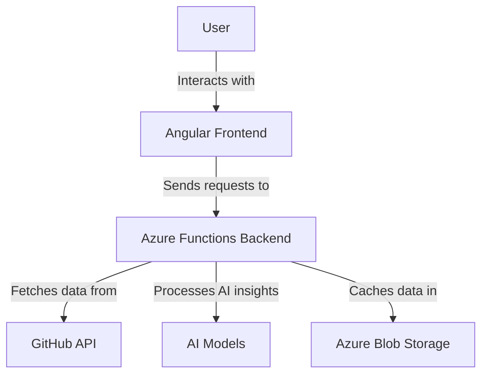
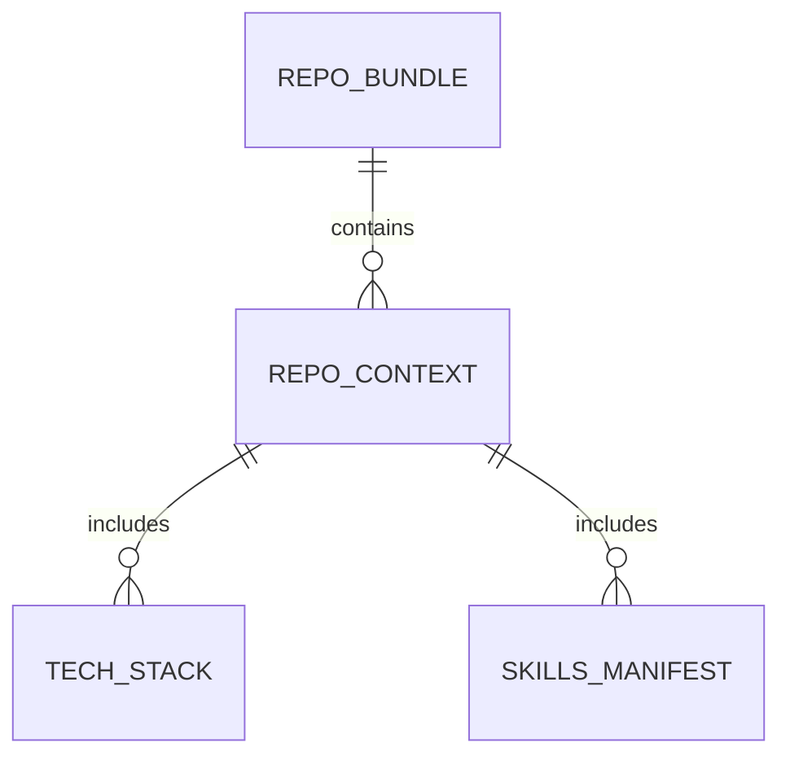
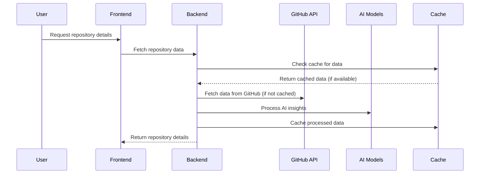

# 🏗️ System Architecture

## 📖 Overview

This document outlines the architecture of the Portfolio Project, a full-stack application designed to showcase GitHub repositories with AI-powered insights. The system integrates an Angular frontend, an Azure Functions backend, and AI-driven recommendations to deliver a seamless user experience.

---

## 🏛️ High-Level Architecture

The architecture follows a modular design, ensuring scalability, maintainability, and performance optimization.

---

## 🧩 Core Components

### Frontend
- **Purpose**: Provide an interactive user interface for browsing and querying repositories.
- **Technology**: Angular 17+, Tailwind CSS
- **Location**: `src/` directory
- **Responsibilities**:
  - Render repository details, including `README.md` with sanitized Markdown and Table of Contents.
  - Handle user interactions and API requests.
  - Implement theming (dark/light mode).
- **Interfaces**: REST API, DOMPurify, Marked.js

### Backend
- **Purpose**: Serve API endpoints and process data for the frontend.
- **Technology**: Azure Functions, Python 3.11+
- **Location**: `api/` directory
- **Responsibilities**:
  - Fetch repository data from GitHub.
  - Process AI-driven insights and recommendations.
  - Cache data for performance optimization.
- **Interfaces**: GitHub API, Azure Blob Storage, AI Models

### AI Models
- **Purpose**: Provide semantic scoring and recommendations for repositories.
- **Technology**: Sentence Transformers, Python
- **Location**: `api/ai/` directory
- **Responsibilities**:
  - Flatten repository context into natural language for AI processing.
  - Generate semantic embeddings and scores.
- **Interfaces**: Backend, AI libraries

### Caching Layer
- **Purpose**: Optimize performance by reducing redundant API calls.
- **Technology**: Azure Blob Storage, In-memory caching
- **Location**: `api/config/cache_manager.py`
- **Responsibilities**:
  - Store and retrieve cached repository data.
  - Manage cache expiration and invalidation.
- **Interfaces**: Backend, Azure Storage

---

## 📊 Data Models & Schema

### Key Data Entities
- **Repository Bundle**: Aggregated data for a GitHub repository, including metadata, context, and AI insights.
- **Repository Context**: Detailed information about the repository, such as project identity, tech stack, and skills.
- **AI Insights**: Semantic scores and recommendations generated by AI models.
- **Cache Entries**: Cached repository bundles stored in Azure Blob Storage.

### Relationships
- Repository Bundle → Repository Context: Each bundle contains detailed context for a repository.
- Repository Context → Tech Stack: Context includes primary and secondary technologies.
- Repository Context → Skills Manifest: Context includes technical and domain-specific skills.

---

## 🔄 Data Flow & Interactions

### Request/Response Flow
1. **Frontend Request**: User interacts with the frontend to request repository details.
2. **Cache Check**: Backend checks the cache for existing data.
3. **GitHub Fetch**: If data is not cached, backend fetches it from GitHub.
4. **AI Processing**: Backend processes the data with AI models to generate insights.
5. **Cache Update**: Processed data is cached for future requests.
6. **Frontend Response**: Backend returns the data to the frontend for rendering.

---

## 🚀 Deployment & Environment

### Development Environment
- **Frontend**:
  - Install dependencies: `npm install`
  - Start development server: `npm run start`
- **Backend**:
  - Install dependencies: `pip install -r requirements.txt`
  - Start Azure Functions locally: `func start`

### Production Deployment
- **Frontend**:
  - Build production files: `npm run build`
  - Deploy to Azure Static Web Apps.
- **Backend**:
  - Deploy Azure Functions using `func azure functionapp publish`.

---

## 🔐 Security Considerations

- **Sanitization**: All user-generated content is sanitized using DOMPurify to prevent XSS attacks.
- **Authentication**: Backend uses managed identities for secure access to Azure resources.
- **Error Handling**: Comprehensive error handling ensures graceful degradation of services.

---

## 📄 References

- [README.md](./README.md): Project overview and usage instructions
- [SKILLS-INDEX.md](./SKILLS-INDEX.md): Skills and competencies demonstrated in the project
- [api/config/fine_tuning.py](./api/config/fine_tuning.py): AI model fine-tuning implementation
- [api/ai/repo_scoring_service.py](./api/ai/repo_scoring_service.py): Semantic scoring service
- [src/app/projects/project/project.component.ts](./src/app/projects/project/project.component.ts): Project detail view implementation
