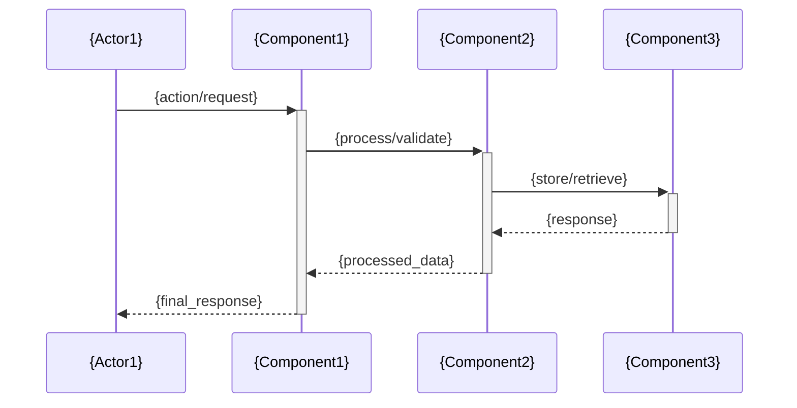

# ARCHITECTURE.md Template & Agent Instructions

## AGENT USAGE RULES
This template guides generation of comprehensive architecture documentation:
1. Create system overview with mermaid diagrams
2. Document component interactions and data flow
3. Explain design decisions and trade-offs
4. Include deployment and security considerations
5. Use consistent technical terminology and clear explanations

## TEMPLATE STRUCTURE

```markdown
# 🏗️ System Architecture

## 📖 Overview
{Brief description of the system/project architecture and its primary purpose}

---

## 🏛️ High-Level Architecture

```mermaid
graph TD
    A[{Component}] --> B[{Component}]
    B --> C[{Component}]
    C --> D[{Component}]
    
    subgraph "{Subsystem Name}"
        E[{Component}]
        F[{Component}]
    end
    
    B --> E
    F --> D
```

{Description of the high-level architecture and component relationships}

---

## 🧩 Core Components

### {Component Name} (e.g., API Layer)
- **Purpose**: {What this component does}
- **Technology**: {Languages, frameworks, tools used}
- **Location**: `{file_path_or_directory}`
- **Responsibilities**:
  - {Primary function}
  - {Secondary function}
  - {Additional function}
- **Interfaces**: {How it communicates with other components}

### {Component Name} (e.g., Data Layer)
- **Purpose**: {What this component does}
- **Technology**: {Languages, frameworks, tools used}
- **Location**: `{file_path_or_directory}`
- **Responsibilities**:
  - {Primary function}
  - {Secondary function}
- **Interfaces**: {How it communicates with other components}

### {Component Name} (e.g., User Interface)
- **Purpose**: {What this component does}
- **Technology**: {Languages, frameworks, tools used}
- **Location**: `{file_path_or_directory}`
- **Responsibilities**:
  - {Primary function}
  - {Secondary function}
- **Interfaces**: {How it communicates with other components}

---

## 📊 Data Models & Schema

```mermaid
erDiagram
    {ENTITY1} ||--o{ {ENTITY2} : "relationship"
    {ENTITY2} ||--|| {ENTITY3} : "relationship"
    
    {ENTITY1} {
        {type} {field_name}
        {type} {field_name}
    }
    
    {ENTITY2} {
        {type} {field_name}
        {type} {field_name}
    }
```

### Key Data Entities
- **{Entity Name}**: {Description and primary attributes}
- **{Entity Name}**: {Description and primary attributes}
- **{Entity Name}**: {Description and primary attributes}

### Relationships
- {Entity1} → {Entity2}: {Relationship description}
- {Entity2} → {Entity3}: {Relationship description}

---

## 🔄 Data Flow & Interactions



### Request/Response Flow
1. **{Step 1}**: {Description of what happens}
2. **{Step 2}**: {Description of what happens}
3. **{Step 3}**: {Description of what happens}
4. **{Step 4}**: {Description of what happens}

---

## 🚀 Deployment & Environment

### Development Environment
- **Platform**: {OS/Environment requirements}
- **Dependencies**: {List key dependencies}
- **Setup**: {Brief setup instructions or reference to README}

### Production Considerations
- **Scalability**: {How the system scales}
- **Performance**: {Performance characteristics}
- **Monitoring**: {Logging and monitoring approach}

### Configuration Management
- **Environment Variables**: {Key configuration options}
- **Secrets**: {How sensitive data is handled}
- **Feature Flags**: {If applicable}

---

## 🔒 Security Architecture

### Authentication & Authorization
- **Authentication**: {How users/systems are authenticated}
- **Authorization**: {How access control is managed}
- **Session Management**: {How sessions are handled}

### Data Protection
- **Encryption**: {Data encryption strategies}
- **Input Validation**: {How inputs are validated}
- **Data Privacy**: {Privacy considerations}

### Security Measures
- **{Security Measure}**: {Description}
- **{Security Measure}**: {Description}

---

## ⚡ Error Handling & Resilience

### Error Management Strategy
- **Error Detection**: {How errors are identified}
- **Error Reporting**: {How errors are logged/reported}
- **Error Recovery**: {How the system recovers from errors}

### Resilience Patterns
- **{Pattern Name}**: {How it's implemented}
- **{Pattern Name}**: {How it's implemented}

---

## 🎯 Design Decisions & Trade-offs

### Key Architectural Decisions
1. **{Decision Topic}**
   - **Decision**: {What was decided}
   - **Rationale**: {Why this decision was made}
   - **Alternatives**: {Other options considered}
   - **Trade-offs**: {What was gained/lost}

2. **{Decision Topic}**
   - **Decision**: {What was decided}
   - **Rationale**: {Why this decision was made}
   - **Alternatives**: {Other options considered}
   - **Trade-offs**: {What was gained/lost}

### Known Limitations
- **{Limitation}**: {Description and impact}
- **{Limitation}**: {Description and impact}

### Future Considerations
- **{Future Enhancement}**: {Planned improvement}
- **{Future Enhancement}**: {Planned improvement}

---

## 📁 Directory Structure & Organization

```
{project_name}/
├── {directory}/          # {Purpose}
│   ├── {subdirectory}/   # {Purpose}
│   └── {file}            # {Purpose}
├── {directory}/          # {Purpose}
│   ├── {file}            # {Purpose}
│   └── {file}            # {Purpose}
└── {file}                # {Purpose}
```

### Organization Principles
- **{Principle}**: {How code/files are organized}
- **{Principle}**: {How code/files are organized}

---

## 🔗 External Dependencies

| Dependency | Purpose | Version | Documentation |
|------------|---------|---------|---------------|
| {dependency} | {purpose} | {version} | [{link}]({url}) |
| {dependency} | {purpose} | {version} | [{link}]({url}) |

---

## 📚 References
- [Project README](README.md)
- [Skills Documentation](SKILLS-INDEX.md)
- [{External Resource}]({url})
```

## CONTENT GENERATION GUIDELINES

### Architecture Analysis Strategy:
1. **File Structure Analysis**: Examine directory organization for architectural patterns
2. **Code Analysis**: Identify modules, classes, and their relationships
3. **Configuration Analysis**: Review config files for system dependencies
4. **Documentation Mining**: Extract existing architectural information

### Component Identification Rules:
- **Logical Separation**: Group related functionality
- **Clear Interfaces**: Define how components interact
- **Technology Grouping**: Organize by tech stack or purpose
- **Responsibility Mapping**: Single responsibility per component

### Diagram Generation Guidelines:
- **High-Level**: Show major components and data flow
- **Data Models**: Include key entities and relationships
- **Sequence Diagrams**: Show important user/system interactions
- **Use Mermaid**: Consistent diagram format across all documentation

### Design Decision Documentation:
- **Context**: Why the decision was necessary
- **Options**: What alternatives were considered
- **Rationale**: Technical/business reasons for choice
- **Trade-offs**: Benefits and drawbacks of the decision

### Quality Standards:
- Technical accuracy and precision
- Clear, professional language
- Comprehensive coverage of system aspects
- Logical flow and organization
- Cross-references to related documentation

